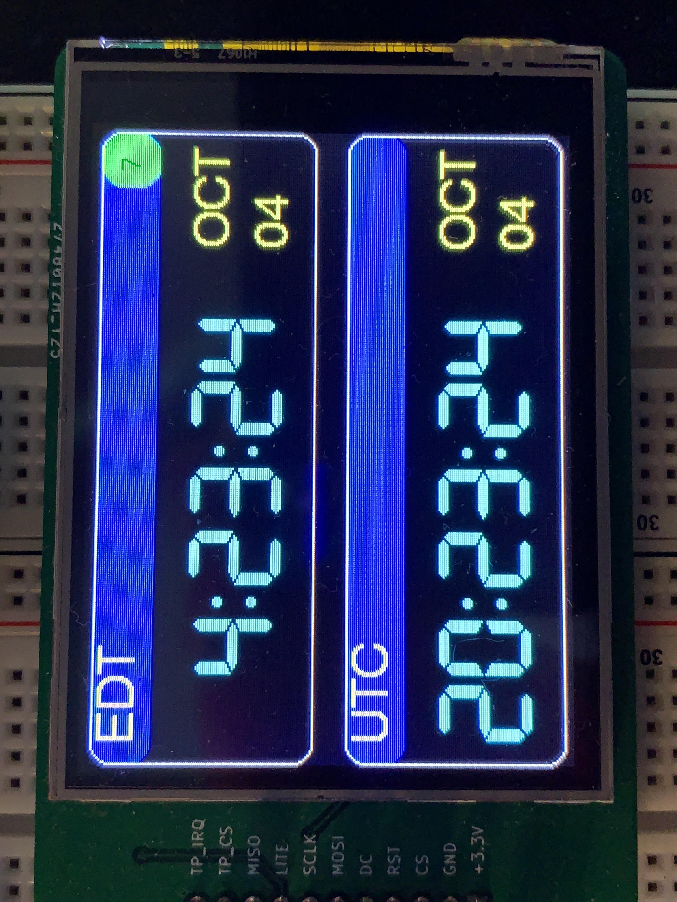

# GPS clock
 
This is an Arduino-based digital clock using a GPS module, Blue-Pill microcontroller, and ILI9341 TFT display.  Accuracy is within a few microseconds.  See w8bh.net for details and step-by-step explanation.
 
